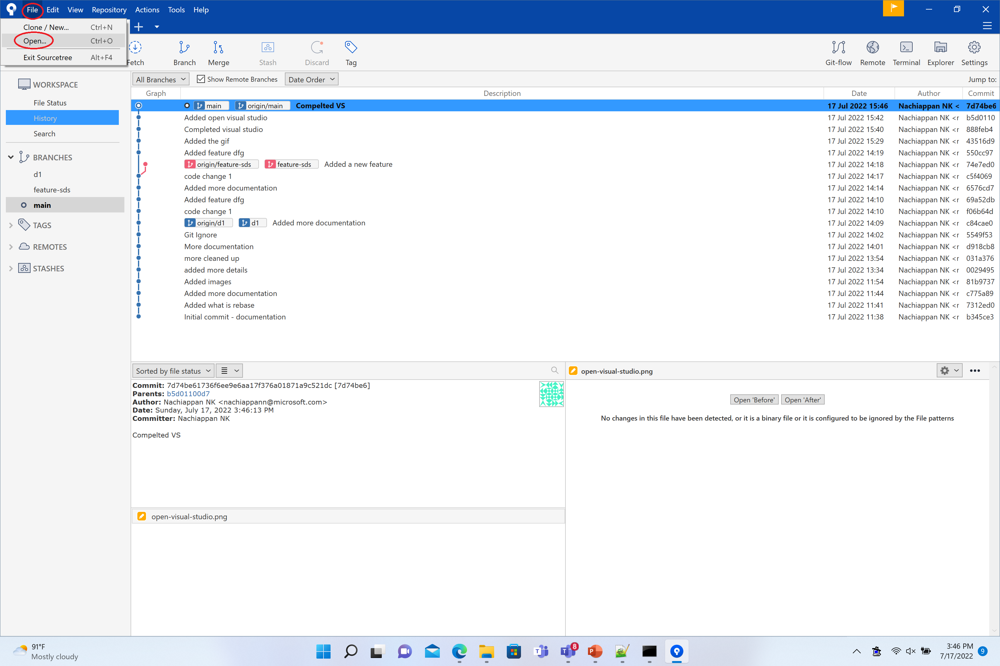
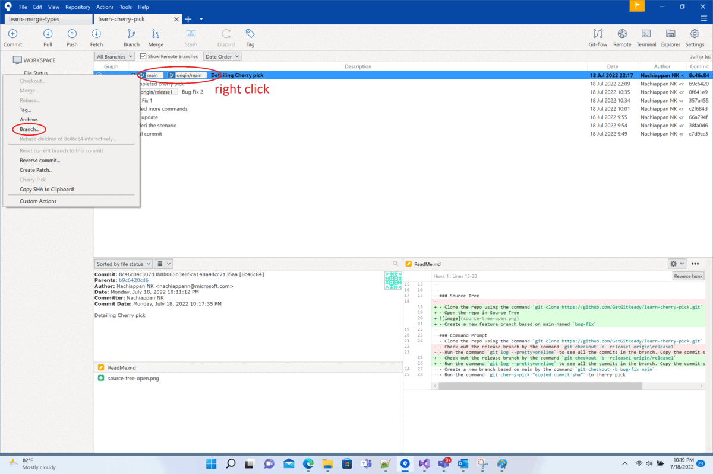
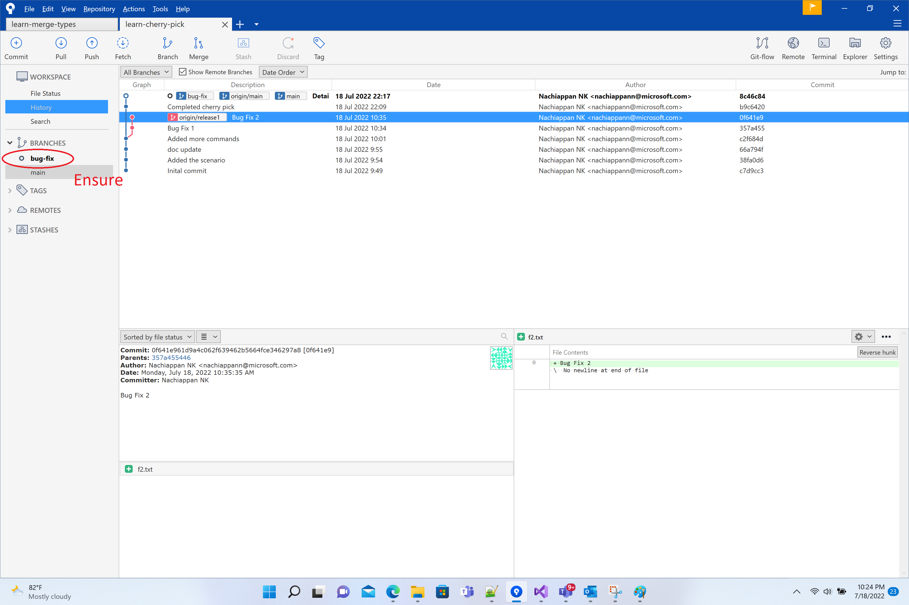
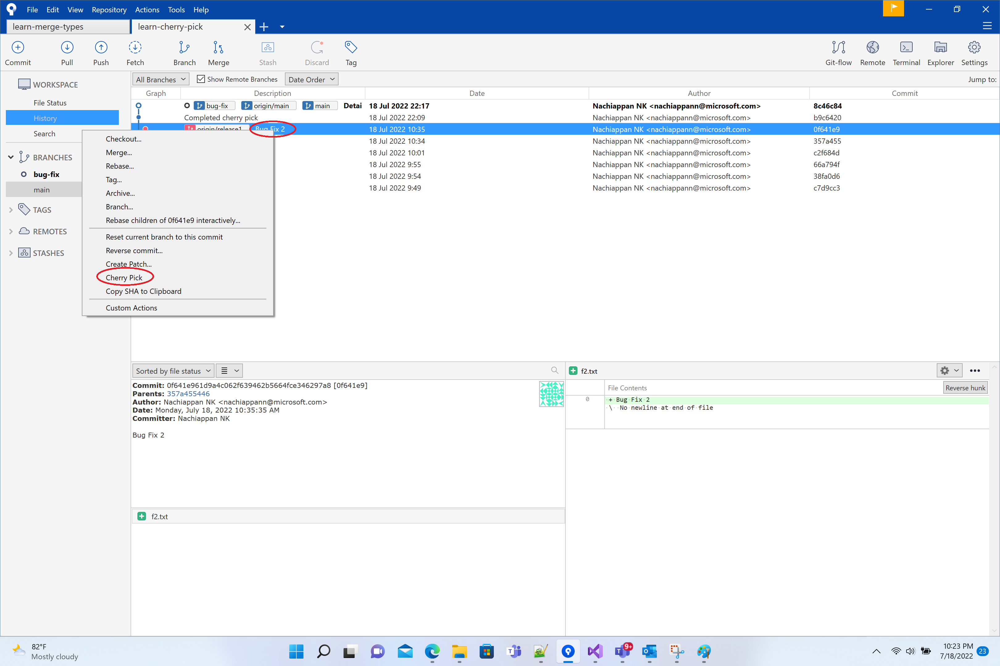

# Cherry Pick

## Introduction
- Cherry pick is a git operation
- Cherry pick enables picking a specific commit from one branch to another branch
- This is typically used for bug fixes amongst different release branches

## Scenario
- The below picture describes a scenario where cherry picking would be appropriate
- The commit x in release branch 1 is needed for to be merged back in to main

## How to cherry pick

### Visual studio

### Source Tree
- Clone the repo using the command `git clone https://github.com/GetGitReady/learn-cherry-pick.git`
- Open the repo in Source Tree

- Create a new feature branch based on main named `bug-fix`

- Ensure the branch `bug-fix` is checkedout

- Cherry pick the commit "Bug fix 2"

### Command Prompt
- Clone the repo using the command `git clone https://github.com/GetGitReady/learn-cherry-pick.git`
- Check out the release branch by the command `git checkout -b  release1 origin/release1`
- Run the command `git log --pretty=oneline` to see all the commits in the branch. Copy the commit sha of "Bug Fix 2"
- Create a new branch based on main by the command `git checkout -b bug-fix main` 
- Run the command `git cherry-pick "copied commit sha"` to cherry pick
